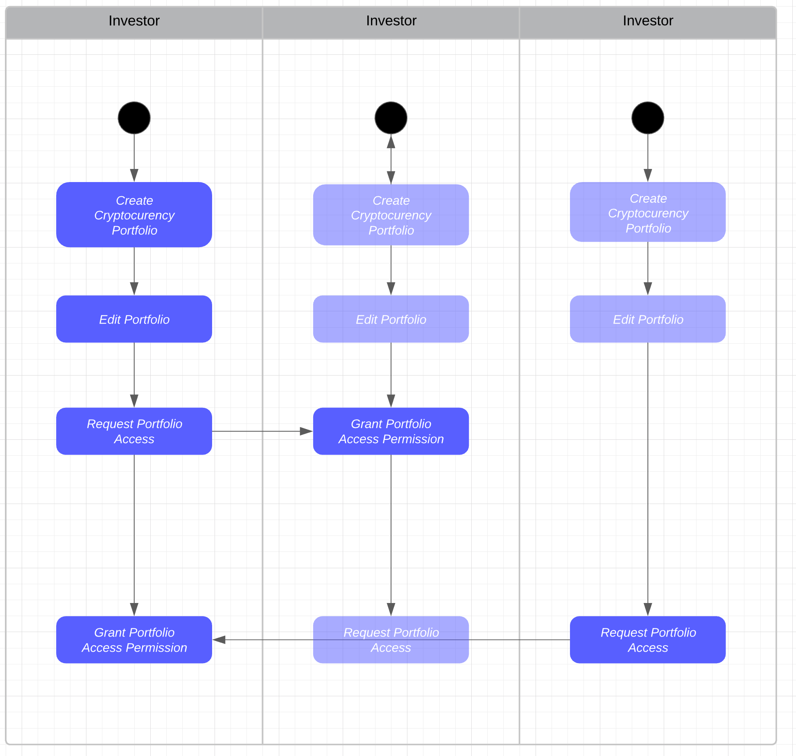
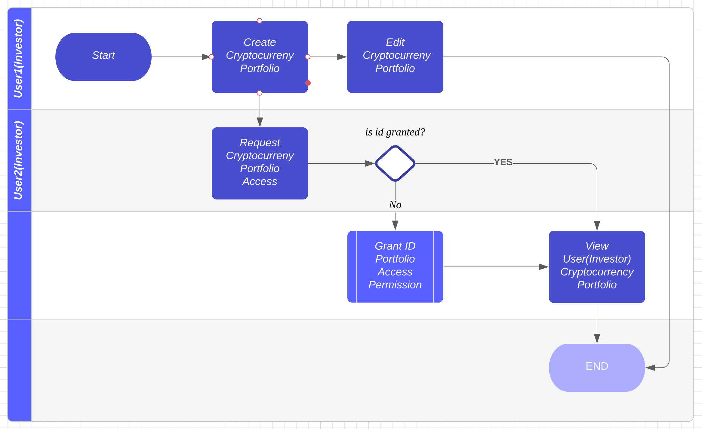

# Dortfolio - Decentralized Portfolio

## Introduction

In finance, a **portfolio**  is a collection of investments held by an investment company, hedge fund, financial institution or individual. 

It's valuable information that should be protected. In some situation, a portfolio is the top-secret that can't be shared to the public. How can you share the investment portfolio without data leaking, even the platform itself can't touch it? How can you share it with trust identity only?

Decentralized blockchain technology is your choice.

---
## Blockstack Decentralized Plantform

---

## Design of this Dapp
### Activity UML

### Flowchart
